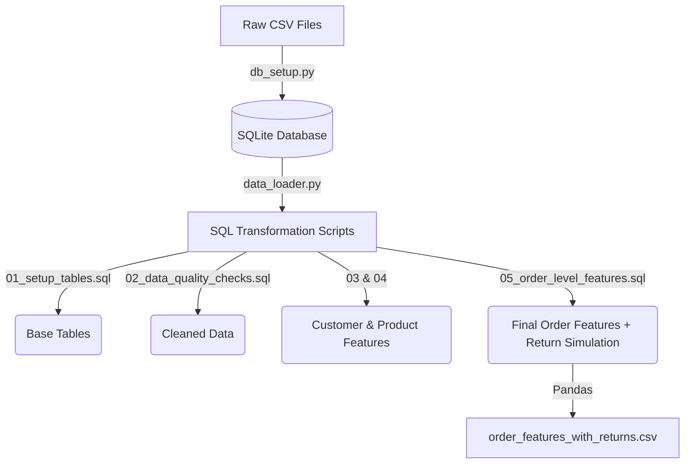

# Data Pipeline & Architecture

Our architecture is designed around an **SQL-first** approach, leveraging SQLite for rapid, in-memory data transformation before passing the engineered features to the Python ML pipeline.

## Architecture Overview

The pipeline transitions raw CSV data into ML-ready datasets through a series of SQL scripts.

## Python Execution Layer

The execution layer lives in the `src/` directory and manages the database state and script execution.

### `src/sql_executor.py`
A robust wrapper around the `sqlite3` library. 
- Automatically manages database connections.
- Safely splits `.sql` files into individual statements (using `;` as a delimiter) to ensure sequential execution.
- Extracts the results of the final `SELECT` statement in any SQL script and exports it to a Pandas DataFrame.

### `src/data_loader.py`
The orchestrator of the entire feature engineering pipeline.
- It iterates through the SQL files in the `sql/` directory in numerical order.
- It executes each script via the `SQLExecutor`.
- It saves the output of each major transformation step into the `data/sql_outputs/` directory as CSVs for caching and auditing.

## The 5-Step SQL Transformation

Our feature engineering is handled natively in SQL to ensure performance and portability. The process is broken into 5 sequential scripts:

### 1. `01_setup_tables.sql`
**Purpose:** Schema definition and raw data ingestion. Drops and recreates normalized tables (`customers`, `orders`, `order_items`, `products`, `reviews`).

### 2. `02_data_quality_checks.sql`
**Purpose:** Validation and anomaly detection. Runs aggregations to flag missing dates and orphaned records, outputting a quality report.

### 3. `03_customer_features.sql`
**Purpose:** Customer behavioral aggregations. Calculates basic LTV, total order counts, and geographical distributions.

### 4. `04_product_features.sql`
**Purpose:** Complex product and category-level risk profiling.
**Key Logic Used:**
- **Sales & Satisfaction Aggregation:** Calculates `times_ordered`, `avg_price`, and `avg_review_score` per product.
- **Risk Indicators with Jitter:** We introduce probabilistic jitter to our threshold rules to prevent the ML models from learning exact hardcoded cutoffs. For example:
  - `high_complaint_product` is flagged if the average review score is `< (2.8 + RANDOM_JITTER)`.
  - `high_dissatisfaction_rate` is flagged if the percentage of 1 and 2-star reviews exceeds a threshold between 25% and 35%.

### 5. `05_order_level_features.sql`
**Purpose:** Final feature assembly and the **Target Label Simulation Engine**.

- **Feature Assembly:** Joins customer, product, delivery, and review data into a single wide view (`order_features_raw`).
- **Return Probability Scoring:** Calculates a continuous `return_probability_score` (ranging roughly from 0.02 to 0.95) using a strictly additive formula:
  - *Dominant Monotonic Signal:* `review_score` (1-star adds +0.60, 5-star adds +0.02).
  - *Secondary Additive Signals:* `delivery_delay_days` (adds up to +0.20 if late) and `freight_ratio` (adds up to +0.08 if shipping is expensive).
  - *Categorical Risk Injection:* Adds hidden risk modifiers based on `product_category` (e.g., +0.15 for furniture) and `customer_state`. 
  **Crucially, because these categories are label-encoded as integers in Python, linear models (Logistic Regression) fail to extract this risk, while Tree models (XGBoost) capture it perfectly.**
  
- **Stochastic Label Generation:** The final `is_returned` binary flag is generated by rolling a random number against the sigmoid probability, yielding an overall highly realistic 12% return rate.
